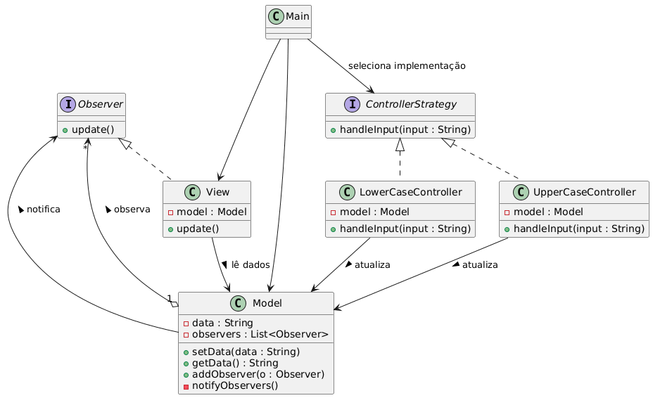

# Unindo Strategy e Observer (MVC)

## O que é MVC?

O **MVC (Model-View-Controller)** é um padrão arquitetural que separa a aplicação em três camadas principais:

- **Model**: representa os dados e regras de negócio.
- **View**: responsável pela interface com o usuário.
- **Controller**: processa entradas do usuário e decide como o Model e a View devem reagir.

O MVC é um exemplo clássico de como **combinar diferentes padrões de projeto** para alcançar baixo acoplamento e alta coesão.

---

## Como Strategy e Observer se aplicam ao MVC?

- **Controller como Strategy**  
  O Controller implementa a lógica de controle da aplicação. Ele pode variar conforme a forma de interação (mouse, teclado, API, etc.).  
  Assim como no **Strategy Pattern**, diferentes controladores podem ser trocados para definir estratégias distintas de manipulação dos dados.

- **View como Observer do Model**  
  A View precisa refletir o estado do Model sempre que houver mudanças. Isso é obtido com o **Observer Pattern**, onde a View se inscreve como observadora do Model e é automaticamente notificada quando os dados mudam.

---

## Estrutura

- **Model**: armazena dados e regras de negócio. Notifica as Views quando há mudanças (Observer).  
- **View**: observa o Model e atualiza a interface sempre que for notificada.  
- **Controller**: atua como Strategy, decidindo como o Model será manipulado de acordo com a entrada do usuário.

---

## Exemplo

### Diagrama UML (simplificado)



### Código

```java
// Observer (View)
public interface Observer {
    void update();
}

// Model (Observable)
import java.util.ArrayList;
import java.util.List;

public class Model {
    private String data;
    private List<Observer> observers = new ArrayList<>();

    public void setData(String data) {
        this.data = data;
        notifyObservers();
    }

    public String getData() {
        return data;
    }

    public void addObserver(Observer o) {
        observers.add(o);
    }

    private void notifyObservers() {
        for (Observer o : observers) {
            o.update();
        }
    }
}

// View (Observer concreto)
public class View implements Observer {
    private Model model;

    public View(Model model) {
        this.model = model;
        model.addObserver(this);
    }

    @Override
    public void update() {
        System.out.println("View atualizada: " + model.getData());
    }
}

// Strategy (Controller)
public interface ControllerStrategy {
    void handleInput(String input);
}

// Implementações do Strategy (Controllers diferentes)
public class UpperCaseController implements ControllerStrategy {
    private Model model;

    public UpperCaseController(Model model) {
        this.model = model;
    }

    @Override
    public void handleInput(String input) {
        model.setData(input.toUpperCase());
    }
}

public class LowerCaseController implements ControllerStrategy {
    private Model model;

    public LowerCaseController(Model model) {
        this.model = model;
    }

    @Override
    public void handleInput(String input) {
        model.setData(input.toLowerCase());
    }
}

// Classe principal para demonstrar
public class Main {
    public static void main(String[] args) {
        Model model = new Model();
        View view = new View(model);

        // Usando Strategy: diferentes Controllers
        ControllerStrategy controller = new UpperCaseController(model);
        controller.handleInput("mvc com strategy e observer");

        controller = new LowerCaseController(model);
        controller.handleInput("MVC COM STRATEGY E OBSERVER");
    }
}
```