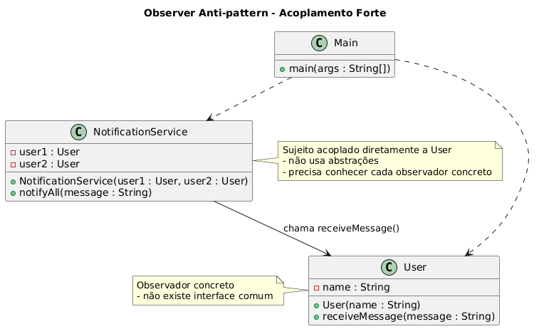

# Acoplamento Forte como Anti-pattern do Observer Pattern

## O que é Acoplamento Forte?

O **acoplamento forte** ocorre quando duas ou mais classes dependem diretamente umas das outras de forma rígida.  
No contexto do **Observer Pattern**, isso significa que o sujeito conhece explicitamente cada observador e chama métodos específicos deles, ao invés de trabalhar com uma **abstração genérica (interface)**.

Esse tipo de design quebra a flexibilidade e a extensibilidade que o **Observer Pattern** deveria oferecer.

## Por que é um Anti-pattern no contexto do Observer Pattern?

Quando implementado com acoplamento forte, o mecanismo de notificação perde as principais vantagens do padrão, trazendo vários problemas:

## Problemas do Acoplamento Forte

- **Alta dependência entre classes**  
O sujeito precisa conhecer cada observador concreto, dificultando a manutenção.

- **Baixa reutilização**  
O código não pode ser facilmente reaproveitado em outros contextos sem trazer junto os observadores.

- **Dificuldade para estender**  
Adicionar um novo observador exige modificar diretamente o código do sujeito.

- **Quebra do Princípio Aberto/Fechado (OCP)**  
Toda vez que surge um novo observador, a classe do sujeito precisa ser alterada.

- **Testes mais complexos**  
O sujeito depende de classes concretas, tornando difícil criar testes isolados com mocks ou stubs.

## Exemplo

### Diagrama UML



### Código

```java
// Sujeito com acoplamento forte: conhece cada observador concreto
public class NotificationService {
    private User user1;
    private User user2;

    public NotificationService(User user1, User user2) {
        this.user1 = user1;
        this.user2 = user2;
    }

    // Notificação diretamente nos observadores concretos
    public void notifyAll(String message) {
        user1.receiveMessage(message);
        user2.receiveMessage(message);
    }
}

// Observador concreto (sem interface genérica)
public class User {
    private String name;

    public User(String name) {
        this.name = name;
    }

    public void receiveMessage(String message) {
        System.out.println(name + " recebeu notificação: " + message);
    }
}

// Classe principal demonstrando o problema
public class Main {
    public static void main(String[] args) {
        User alice = new User("Alice");
        User bob = new User("Bob");

        // NotificationService está rigidamente acoplado a User
        NotificationService service = new NotificationService(alice, bob);

        // Se quisermos adicionar Carol, precisamos modificar NotificationService
        service.notifyAll("Nova mensagem disponível!");
    }
}
```