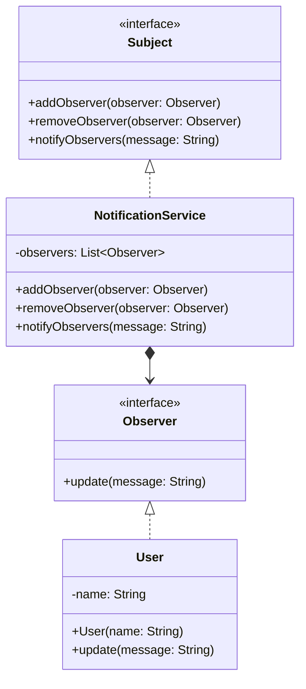

# Observer Pattern

## O que é?

O **Observer Pattern** é um padrão de projeto comportamental que define uma dependência **um-para-muitos** entre objetos, de forma que, quando um objeto muda de estado, todos os seus dependentes (observadores) são notificados automaticamente.  
Ele promove um **baixo acoplamento** entre os objetos que emitem eventos (sujeitos) e os que reagem a eles (observadores).

## Quando usar?

- Quando uma mudança em um objeto deve disparar atualizações em outros objetos automaticamente.  
- Quando você deseja implementar um sistema de **eventos/notificações** sem acoplar fortemente os emissores e os receptores.  
- Quando diferentes partes da aplicação precisam **observar o mesmo estado** ou evento.  

## Estrutura

- **Subject (Observable)**: mantém uma lista de observadores e fornece métodos para adicioná-los, removê-los e notificá-los.  
- **Observer**: define a interface comum para receber atualizações.  
- **ConcreteObserver**: implementação que reage às notificações do sujeito.  
- **ConcreteSubject**: estado monitorado, que notifica os observadores sempre que sofre mudanças.  

## Exemplo

### Diagrama UML



### Código

```java
// Observer Interface (define o contrato para receber notificações)
public interface Observer {
    void update(String message);
}

// ConcreteObserver (implementa a ação a ser tomada quando notificado)
public class User implements Observer {
    private String name;

    public User(String name) {
        this.name = name;
    }

    @Override
    public void update(String message) {
        System.out.println(name + " recebeu notificação: " + message);
    }
}

// Subject Interface (define operações para gerenciar observadores)
public interface Subject {
    void addObserver(Observer observer);
    void removeObserver(Observer observer);
    void notifyObservers(String message);
}

// ConcreteSubject (estado observado que dispara notificações)
import java.util.ArrayList;
import java.util.List;

public class NotificationService implements Subject {
    private List<Observer> observers = new ArrayList<>();

    @Override
    public void addObserver(Observer observer) {
        observers.add(observer);
    }

    @Override
    public void removeObserver(Observer observer) {
        observers.remove(observer);
    }

    @Override
    public void notifyObservers(String message) {
        for (Observer observer : observers) {
            observer.update(message);
        }
    }
}

// Classe principal para demonstrar
public class Main {
    public static void main(String[] args) {
        NotificationService service = new NotificationService();

        Observer user1 = new User("Alice");
        Observer user2 = new User("Bob");
        Observer user3 = new User("Carol");

        service.addObserver(user1);
        service.addObserver(user2);
        service.addObserver(user3);

        // Enviando notificações
        service.notifyObservers("Novo produto disponível!");
        service.notifyObservers("Promoção de 50% OFF!");
    }
}
```
