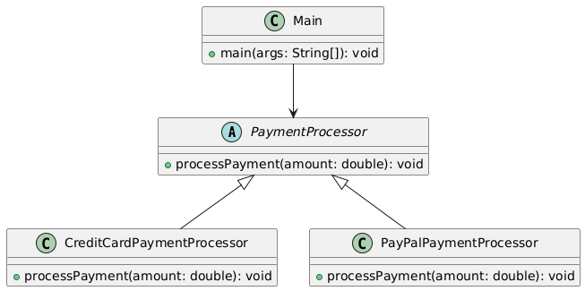

# Herança como Anti-pattern do Strategy Pattern

## O que é Herança?

A **herança** é um mecanismo da programação orientada a objetos onde uma classe (subclasse) herda atributos e métodos de outra (superclasse). Embora útil em muitos casos, seu uso incorreto para variar comportamentos pode levar a um design frágil, difícil de manter e estender.

## Por que é um Anti-pattern no contexto do Strategy Pattern?

Quando usada para implementar **variações de comportamento**, a herança apresenta diversos problemas que o **Strategy Pattern resolve melhor**:

## Problemas da Herança em Variação de Comportamento

- **Crescimento descontrolado da hierarquia de classes**
Cada novo comportamento exige a criação de uma nova subclasse.

- **Baixa reutilização de código**
Comportamentos duplicados se espalham por subclasses, dificultando reutilização.

- **Rigidez no design**
A classe só pode herdar de uma superclasse (na maioria das linguagens), limitando a flexibilidade.

- **Viola o Princípio Aberto/Fechado (OCP)**
Adicionar um novo comportamento exige modificar ou estender a hierarquia de classes.

- **Testes difíceis**
Comportamentos acoplados à herança dificultam testes unitários isolados.

## Exemplo

### Diagrama UML



### Código

```java
// Superclasse base para processadores de pagamento
public abstract class PaymentProcessor {
    public abstract void processPayment(double amount);
}

// Cada novo comportamento exige uma nova subclasse.
public class CreditCardPaymentProcessor extends PaymentProcessor {
    @Override
    public void processPayment(double amount) {
        System.out.println("Pagando R$" + amount + " com cartão de crédito.");
    }
}

public class PayPalPaymentProcessor extends PaymentProcessor {
    @Override
    public void processPayment(double amount) {
        System.out.println("Pagando R$" + amount + " com PayPal.");
    }
}

// Classe principal demonstrando o problema
public class Main {
    public static void main(String[] args) {
        PaymentProcessor processor = new CreditCardPaymentProcessor();
        processor.processPayment(100.0);

        // Trocar o comportamento exige trocar a classe inteira
        //Não é possível trocar o comportamento em tempo de execução sem criar nova instância.
        processor = new PayPalPaymentProcessor();
        processor.processPayment(75.5);
    }
}
```