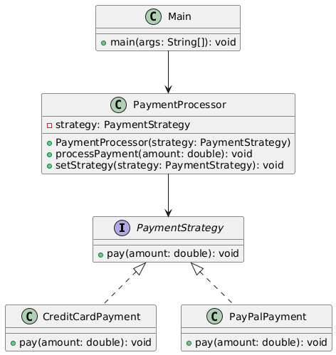

# Strategy Pattern

## O que é?

O **Strategy Pattern** é um padrão de projeto comportamental que permite definir uma família de algoritmos, encapsulá-los em classes separadas e torná-los intercambiáveis. Ele promove o uso da **composição** ao invés da **herança** para variação de comportamento.

## Quando usar?

- Quando você possui múltiplas variações de um mesmo comportamento (por exemplo, métodos de pagamento, algoritmos de ordenação, cálculo de frete).

- Quando deseja evitar blocos condicionais complexos (`if`, `switch`) para decidir o comportamento a ser executado.

- Quando quer seguir o **Princípio Aberto/Fechado** (Open/Closed Principle), permitindo adicionar novos comportamentos sem modificar os existentes.


## Estrutura

- **Context**: classe que utiliza um objeto Strategy para executar o comportamento.

- **Strategy**: define a interface comum para todos os algoritmos.

- **ConcreteStrategy**: implementações específicas da estratégia.

## Exemplo

### Diagrama UML



### Código


```java
// Strategy Interface (define o contrato comum)
public interface PaymentStrategy {
    void pay(double amount);
}

// CreditCardPayment e PayPalPayment (estratégias concretas que implementam o comportamento)
public class CreditCardPayment implements PaymentStrategy {
    @Override
    public void pay(double amount) {
        System.out.println("Pagando R$" + amount + " com cartão de crédito.");
    }
}

public class PayPalPayment implements PaymentStrategy {
    @Override
    public void pay(double amount) {
        System.out.println("Pagando R$" + amount + " com PayPal.");
    }
}

// Context (utiliza uma estratégia para realizar a operação)
public class PaymentProcessor {
    private PaymentStrategy strategy;

    public PaymentProcessor(PaymentStrategy strategy) {
        this.strategy = strategy;
    }

    public void processPayment(double amount) {
        strategy.pay(amount);
    }

    // Permite trocar a estratégia em tempo de execução, se necessário
    public void setStrategy(PaymentStrategy strategy) {
        this.strategy = strategy;
    }
}

// Classe principal para demonstrar
public class Main {
    public static void main(String[] args) {
        // Usando pagamento com cartão
        PaymentStrategy creditCard = new CreditCardPayment();
        PaymentProcessor processor = new PaymentProcessor(creditCard);
        processor.processPayment(100.0);

        // Trocando para pagamento com PayPal
        processor.setStrategy(new PayPalPayment());
        processor.processPayment(75.5);
    }
}
```
